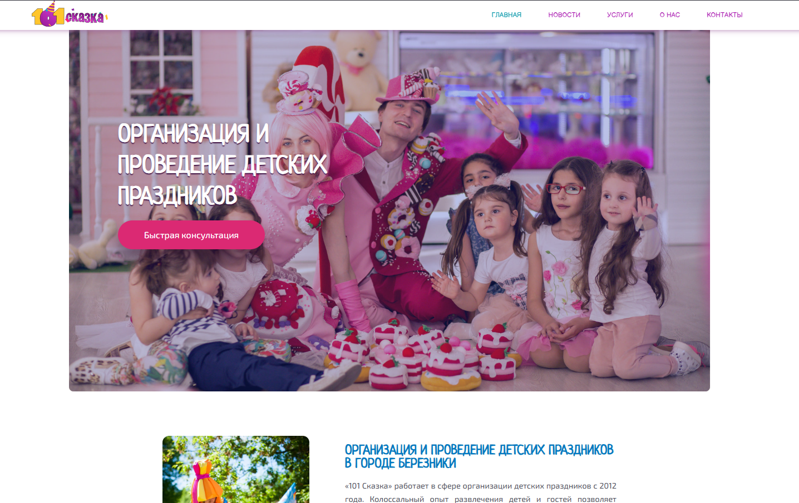
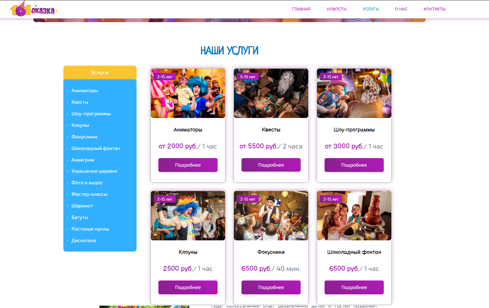
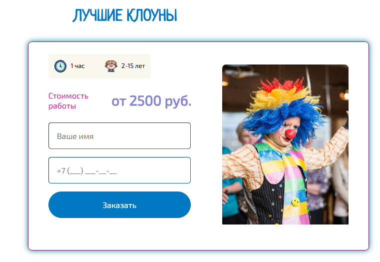

# 📖 101 сказка

> Сайт-визитка для компании, предоставляющей услуги, связанные со сказками и детскими мероприятиями

---

## 🎨 Скриншоты

  
| Главная страница | Услуги | Форма заказа |
|:---:|:---:|:---:|
|  |  |  |

---

## 📝 О проекте

**101 сказка** — это многостраничный веб-сайт, разработанный в качестве **пет-проекта** для демонстрации навыков веб-разработки.

### ✨ Возможности проекта

- 📋 Формы обратной связи и заказа услуг с записью данных в базу данных
- 🧭 Структурированные разделы: главная страница, услуги, новости, о нас, контакты
- 🔐 Административная панель (папка `_admin`)
- 📱 Адаптивный дизайн для корректного отображения на мобильных устройствах

---

## 🛠 Технологии

  
| Категория | Технологии |
|:---|:---|
| **Backend** |  |
| **Frontend** |    |
| **Database** |  |
| **Дополнительно** | Hack (5.7% кодовой базы) |

---

## 📁 Структура проекта

<b>Нажмите, чтобы развернуть</b>

